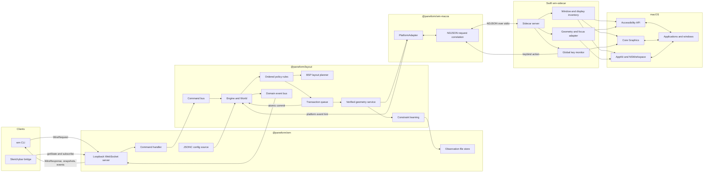
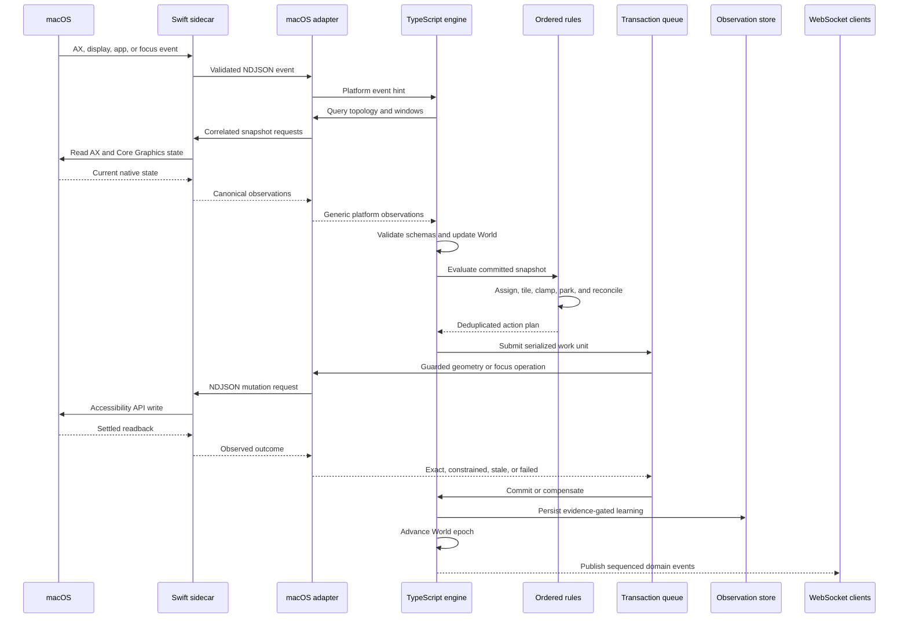
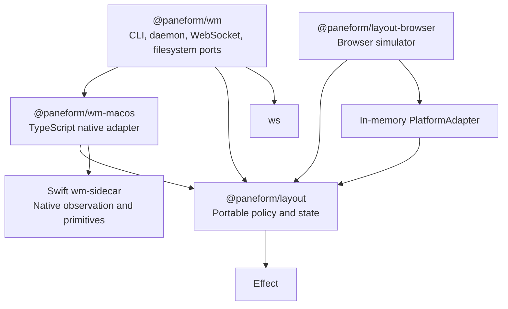

# Architecture Diagrams

These diagrams describe the TypeScript architecture and its thin Swift macOS
native host.

## System Architecture

```mermaid
flowchart LR
  subgraph Clients
    CLI["wm CLI"]
    SK["Sketchybar bridge"]
  end

  subgraph NodeHost["@paneform/wm"]
    WS["Loopback WebSocket server"]
    CH["Command handler"]
    CFG["JSONC config source"]
    OBS["Observation file store"]
  end

  subgraph Core["@paneform/layout"]
    CMD["Command bus"]
    ENG["Engine and World"]
    RULES["Ordered policy rules"]
    BSP["BSP layout planner"]
    TX["Transaction queue"]
    GEO["Verified geometry service"]
    LEARN["Constraint learning"]
    EVENTS["Domain event bus"]
  end

  subgraph MacAdapter["@paneform/wm-macos"]
    ADAPTER["PlatformAdapter"]
    IPC["NDJSON request correlation"]
  end

  subgraph Native["Swift wm-sidecar"]
    SERVER["Sidecar server"]
    INVENTORY["Window and display inventory"]
    GEOMETRY["Geometry and focus adapter"]
    KEYS["Global key monitor"]
  end

  subgraph macOS
    AX["Accessibility API"]
    CG["Core Graphics"]
    APPKIT["AppKit and NSWorkspace"]
    WINDOWS["Applications and windows"]
  end

  CLI -->|"WireRequest"| WS
  WS --> CH
  CH --> CMD
  CMD --> ENG
  ENG --> RULES
  RULES --> BSP
  RULES --> TX
  TX --> GEO
  GEO --> ADAPTER
  GEO --> LEARN
  LEARN --> OBS
  CFG --> ENG
  TX -->|"atomic commit"| ENG
  ENG --> EVENTS
  EVENTS --> WS
  WS -->|"WireResponse, snapshots, events"| CLI
  SK -->|"getState and subscribe"| WS

  ADAPTER <--> IPC
  IPC <-->|"NDJSON over stdio"| SERVER
  SERVER --> INVENTORY
  SERVER --> GEOMETRY
  SERVER --> KEYS

  INVENTORY --> AX
  INVENTORY --> CG
  INVENTORY --> APPKIT
  GEOMETRY --> AX
  GEOMETRY --> APPKIT
  KEYS --> CG
  AX <--> WINDOWS
  CG <--> WINDOWS
  APPKIT <--> WINDOWS

  KEYS -->|"keybind action"| IPC
  ADAPTER -->|"platform event hint"| ENG
```

## Reconciliation Pipeline

```mermaid
sequenceDiagram
  participant OS as macOS
  participant Sidecar as Swift sidecar
  participant Adapter as macOS adapter
  participant Engine as TypeScript engine
  participant Rules as Ordered rules
  participant Tx as Transaction queue
  participant Store as Observation store
  participant WS as WebSocket clients

  OS->>Sidecar: AX, display, app, or focus event
  Sidecar->>Adapter: Validated NDJSON event
  Adapter->>Engine: Platform event hint

  Engine->>Adapter: Query topology and windows
  Adapter->>Sidecar: Correlated snapshot requests
  Sidecar->>OS: Read AX and Core Graphics state
  OS-->>Sidecar: Current native state
  Sidecar-->>Adapter: Canonical observations
  Adapter-->>Engine: Generic platform observations

  Engine->>Engine: Validate schemas and update World
  Engine->>Rules: Evaluate committed snapshot
  Rules->>Rules: Assign, tile, clamp, park, and reconcile
  Rules-->>Engine: Deduplicated action plan
  Engine->>Tx: Submit serialized work unit

  Tx->>Adapter: Guarded geometry or focus operation
  Adapter->>Sidecar: NDJSON mutation request
  Sidecar->>OS: Accessibility API write
  OS-->>Sidecar: Settled readback
  Sidecar-->>Adapter: Observed outcome
  Adapter-->>Tx: Exact, constrained, stale, or failed

  Tx->>Engine: Commit or compensate
  Engine->>Store: Persist evidence-gated learning
  Engine->>Engine: Advance World epoch
  Engine-->>WS: Publish sequenced domain events
```

## Package Boundaries

```mermaid
flowchart TB
  NODE["@paneform/wm<br/>CLI, daemon, WebSocket, filesystem ports"]
  MAC["@paneform/wm-macos<br/>TypeScript native adapter"]
  ENGINE["@paneform/layout<br/>Portable policy and state"]
  SIDECAR["Swift wm-sidecar<br/>Native observation and primitives"]
  RENDERER["@paneform/layout-browser<br/>Browser simulator"]
  SIM["In-memory PlatformAdapter"]
  EFFECT["Effect"]
  WS["ws"]

  NODE --> MAC
  NODE --> ENGINE
  NODE --> WS
  MAC --> ENGINE
  MAC --> SIDECAR
  RENDERER --> ENGINE
  RENDERER --> SIM
  SIM --> ENGINE
  ENGINE --> EFFECT

```
